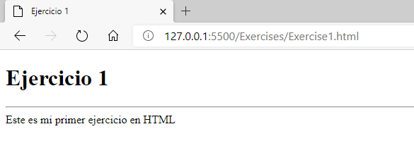
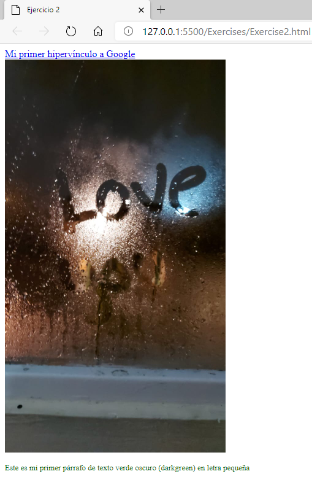
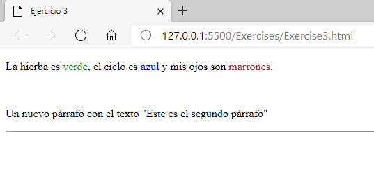
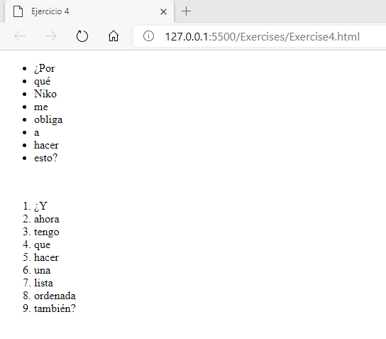
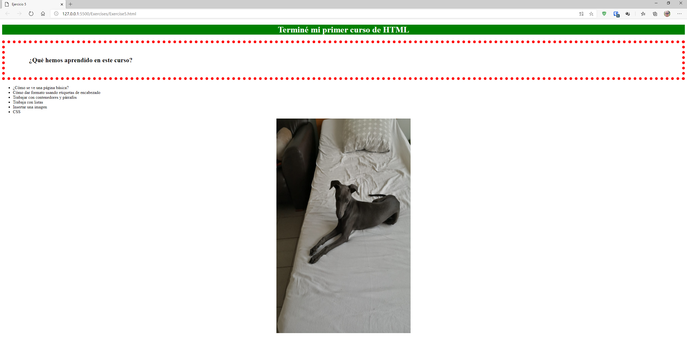

# Ejercicios

> ## Ejercicio 1
>
> Crea una página que se parezca a la siguiente imagen:
>
> 
>
> La página debe contener:
>
> -   El título: "Ejercicio 1"
> -   Un título de cabecera 1
> -   Una línea horizontal
> -   Algún texto

> ## Ejercicio 2
>
> -   Crear una etiqueta HTML que apunte a https://www.google.com y como texto: "Mi primer hipervínculo a Google".
> -   Crear una etiqueta HTML a una imagen con la ubicación "../Images/Ejercicio2.jpg", un texto alternativo del "Ejercicio 2", un ancho de 360 píxeles y un alto de 640 píxeles.
> -   Crear un párrafo con el texto "Este es mi primer párrafo de texto amarillo en letra pequeña". Asegúrate de que el texto es amarillo (yellow) y el tamaño del texto es pequeño (small).
> - Separa cada parte con una regla de ruptura.
>
> El resultado: 
> 

> ## Ejercicio 3
>
> Crear un contenedor en bloque que contenga los siguientes elementos:
>
> 1. Un párrafo con el texto "La hierba es verde, el cielo es azul y mis ojos son marrones."
>    Donde la palabra "verde" está en verde, ....
> 2. Una regla de ruptura
> 3. Un nuevo párrafo con el texto "Este es el segundo párrafo"
> 4. Una línea horizontal
>
> El resultado:
> 

> ## Ejercicio 4
> Crea las siguientes listas:
> 1) Una lista sin orden con el texto "¿Por qué Niko me obliga a hacer esto?" donde cada palabra es un nuevo elemento de la lista.
> 2) Y una lista de orden con el texto: "¿Y ahora tengo que hacer una lista ordenada también?" donde cada palabra es un nuevo elemento de la lista.
>
> El resultado:
> 

> ## Ejercicio 5
> Crear una página que:
> * Enlaces a un fichero CSS externo (no te olvides de hacer ese fichero también)
> * Un elemento h1 con un color de fondo verde, texto en blanco negrita y centrado.
> * Un elemento h2 que contiene una línea roja punteada de 10 píxeles y un relleno horizontal de 50 píxeles y vertical de 90 píxeles
> * un contenedor que centra su texto y contiene una imagen con la ubicación "../Images/Ejercicio5.jpg" con un ancho de 500 píxeles y un alto de 800 píxeles.
>
> El resultado:
> 
